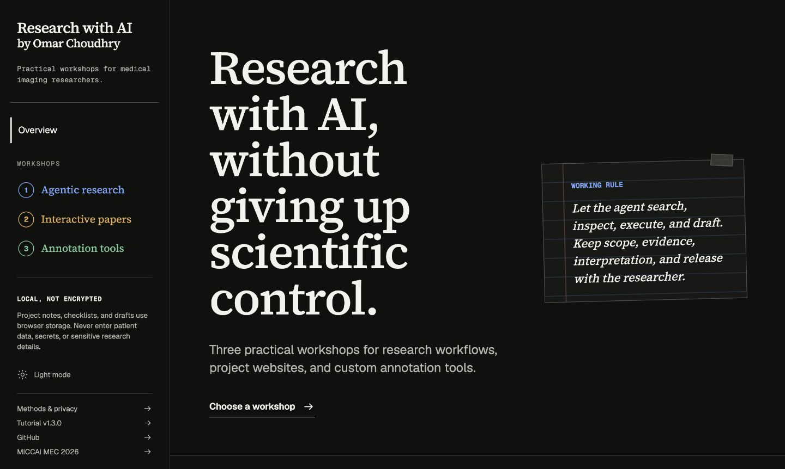
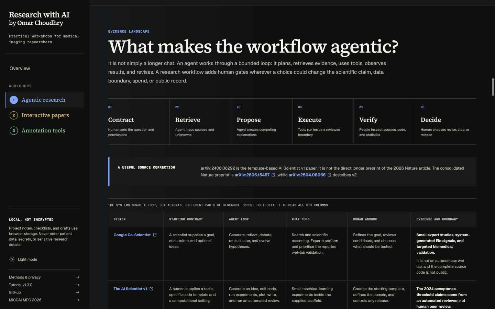
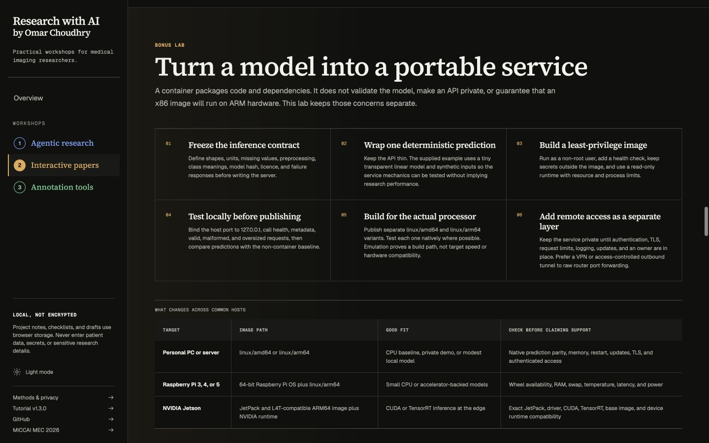
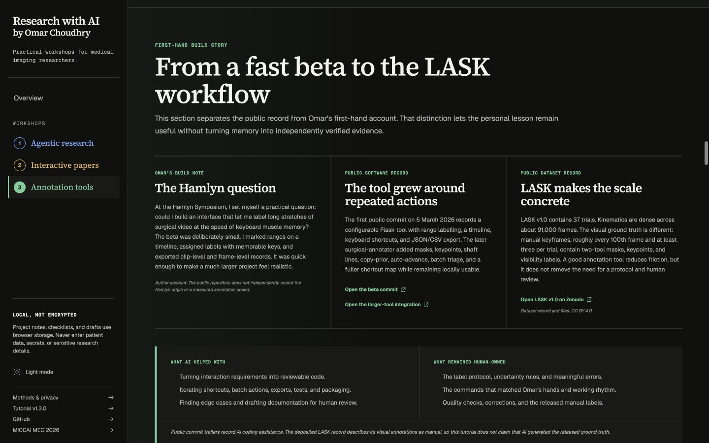
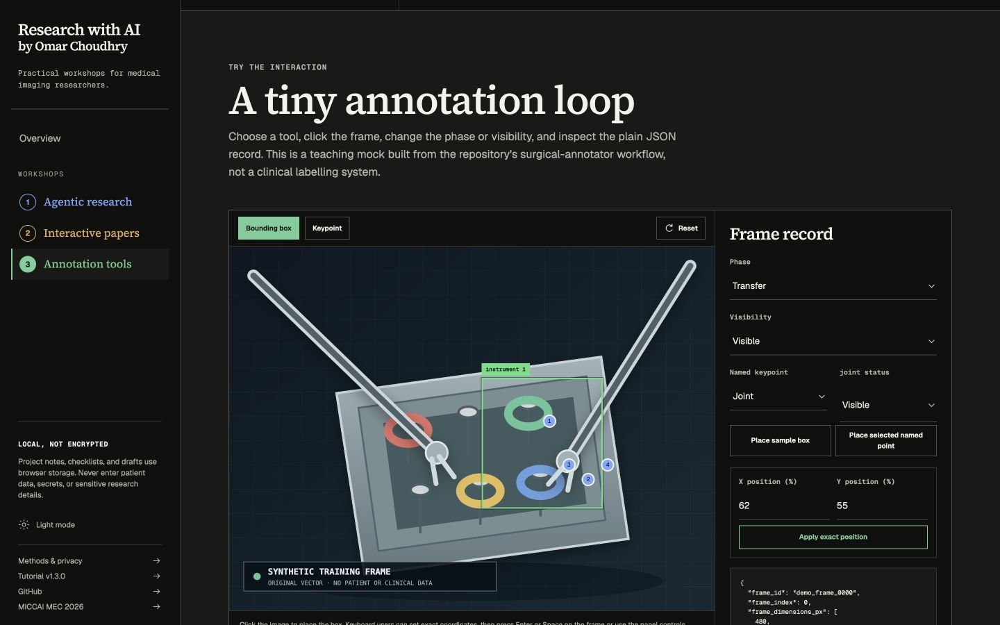

# Research with AI

[](https://github.com/omariosc/research-with-ai/actions/workflows/ci.yml)
[](https://github.com/omariosc/research-with-ai/releases)
[](LICENSE)
[](CONTENT-LICENSE.md)

Three practical, evidence-led workshops for researchers who want to use AI
without giving up scientific control.

<p align="center">
  <a href="https://researchwithai.omarchoudhry.co.uk">
    
  </a>
</p>

The platform combines worked biomedical examples, editable project workspaces,
copyable prompts, explicit approval gates, runnable checks, source libraries,
and exportable research records. It is designed as teaching material, not as a
catalogue of AI products or a substitute for scientific judgement.

> **Release status, checked 26 July 2026:** this repository contains reviewed
> v1.3.0 source and documentation. The four public tutorial hosts still serve
> v1.1.0 while the existing Sites publishing credential is restored. The
> canonical URLs will not change. Use the
> [v1.3.0 GitHub release](https://github.com/omariosc/research-with-ai/releases/tag/v1.3.0)
> or the repository files when an exact current artefact is required.

## Choose a tutorial

| Tutorial | Start here | What you leave with | Source | Citation |
| --- | --- | --- | --- | --- |
| **Agentic AI in Research** | [Open tutorial](https://agenticresearch.omarchoudhry.co.uk) | Research contract, paper reproduction plan, HPC-ready runbook, verification record, and AI-use statement | [`lib/content/agentic.ts`](lib/content/agentic.ts) | [Cite this tutorial](CITING.md#agentic-ai-in-research) |
| **Building a Website for Your Research Using AI** | [Open tutorial](https://interactivepaper.omarchoudhry.co.uk) | Evidence map, rights ledger, accessible research site plan, runnable demo, and release record | [`lib/content/paper.ts`](lib/content/paper.ts) | [Cite this tutorial](CITING.md#building-a-website-for-your-research-using-ai) |
| **Developing Custom Annotation Tools Using AI** | [Open tutorial](https://annotate.omarchoudhry.co.uk) | Versioned protocol, offline tool plan, provenance-aware export, review workflow, and evaluation protocol | [`lib/content/annotation.ts`](lib/content/annotation.ts) | [Cite this tutorial](CITING.md#developing-custom-annotation-tools-using-ai) |

The [shared workshop index](https://researchwithai.omarchoudhry.co.uk) provides
the common entry point. Each dedicated hostname can be submitted, taught from,
and cited independently.

## What makes the tutorials useful

- **One complete research lifecycle.** Field mapping, paper questions,
  repository inspection, reproduction, experiments, HPC jobs, figures,
  writing, and release are connected rather than taught as isolated prompts.
- **Human ownership is explicit.** Agents can inspect, retrieve, propose,
  execute, and draft. The researcher keeps scope, evidence, interpretation,
  governance, and release decisions.
- **Evidence stays inspectable.** Claims link to primary papers, standards,
  repositories, datasets, official documentation, commands, hashes, and
  recorded limits.
- **The activities produce artefacts.** Every tutorial includes a named local
  project, separate notes and progress, editable builders, short practice
  tasks, and a Markdown export.
- **Alternatives are compared honestly.** Hosted, institution-managed, local,
  and offline routes include data, cost, network, hardware, and evidence
  tradeoffs without silently preselecting one.

## Interface tour

<table>
  <tr>
    <td width="50%">
      <a href="https://agenticresearch.omarchoudhry.co.uk">
        
      </a>
      <br>
      <strong>Agentic research</strong><br>
      Original workflow graphic, source correction, and system comparison.
    </td>
    <td width="50%">
      <a href="https://interactivepaper.omarchoudhry.co.uk">
        
      </a>
      <br>
      <strong>Research websites and model services</strong><br>
      A portable FastAPI and Docker lab with hardware-specific acceptance checks.
    </td>
  </tr>
  <tr>
    <td width="50%">
      <a href="https://annotate.omarchoudhry.co.uk">
        
      </a>
      <br>
      <strong>From a fast beta to LASK</strong><br>
      First-hand experience is kept separate from independently checkable evidence.
    </td>
    <td width="50%">
      <a href="https://annotate.omarchoudhry.co.uk#demo">
        
      </a>
      <br>
      <strong>Interactive annotation loop</strong><br>
      Synthetic geometry, explicit visibility, and a plain provenance record.
    </td>
  </tr>
</table>

Additional captures include the
[project workspace](docs/images/agentic-research-workspace.jpg) and
[390 by 844 mobile layout](docs/images/mobile-overview.jpg). Their dimensions,
hashes, capture conditions, and rights are recorded in the
[screenshot manifest](docs/images/README.md).

## Reviewed evidence and downloads

| Artefact | What it demonstrates | Open |
| --- | --- | --- |
| Methods, privacy, and accessibility | Storage boundary, AI disclosure, evidence method, and accessibility target | [Live page](https://researchwithai.omarchoudhry.co.uk/about) |
| Version history | Canonical tutorial URLs and immutable release records | [Live page](https://researchwithai.omarchoudhry.co.uk/versions) |
| BreastMNIST worked evidence pack | Pinned source files and independent prediction-artifact metric re-evaluation | [Live page](https://researchwithai.omarchoudhry.co.uk/worked-examples/medmnist-breast) |
| Agentic science reading notes | Google Co-Scientist, AI Scientist v1 and v2, the related Nature study, and Medical AI Scientist | [Markdown](public/reading-notes/agentic-science-systems-2026-07-26.md) |
| Annotation origin record | Public commits, LASK facts, author account, AI role, and screenshot-rights decision | [Markdown](public/audits/annotation-tool-origin-story-2026-07-26.md) |
| Annotation export audit | Canonical JSON, review CSV round trip, YOLO subset, and declared information loss | [Markdown](public/audits/annotation-round-trip-2026-07-26.md) |
| Model container lab | Locked FastAPI service, synthetic model, Docker profile, tests, and deployment record | [Lab guide](public/worked-examples/model-container-service/README.md) |
| Annotation specification | Immutable v1.3.0 JSON Schema used by the interactive builder | [Schema](public/schemas/annotation-spec-1.3.0.schema.json) |
| Release evidence | Rights, claims, word counts, Docker acceptance, browser QA, and remaining human gates | [v1.3.0 audit](public/audits/platform-release-v1.3.0-2026-07-26.md) |
| Reviewed source snapshot | Source archive generated from the recorded feature commit | [ZIP](public/releases/research-with-ai-v1.3.0-source.zip) and [SHA-256](public/releases/research-with-ai-v1.3.0-source.sha256) |

## Citation

For the complete platform:

> Choudhry, O. (2026). *Research with AI Tutorial Platform* (Version 1.3.0)
> [Software and interactive tutorial collection].
> https://researchwithai.omarchoudhry.co.uk

GitHub can format the platform citation from [CITATION.cff](CITATION.cff).
[CITING.md](CITING.md) provides separate human-readable citations for all three
tutorials, and [CITATIONS.bib](CITATIONS.bib) provides four copy-ready BibTeX
records. No DOI is claimed for this repository. The
[LASK DOI](https://doi.org/10.5281/zenodo.20752651) identifies the dataset, not
this platform or the annotation tutorial.

## Run locally

Requirements:

- Node.js 22.13 or newer
- npm
- Optional: `uv` and Python 3.12 for the external BreastMNIST verification
- Optional: Docker for the portable model-service acceptance route

```bash
git clone https://github.com/omariosc/research-with-ai.git
cd research-with-ai
npm ci
npm run dev
```

Open `http://localhost:3000`.

## Validation

The offline release gate is:

```bash
npm run lint
npm run typecheck
npm test
npm audit --audit-level=high
```

The network-backed evidence checks are:

```bash
npm run check:links
npm run check:annotation-roundtrip
npm run check:medmnist
```

The current suite builds the production application and checks rendered
metadata, project isolation and migration, schemas, citation consistency,
screenshot hashes, annotation round trips, local artefact links, model-service
packaging, edge routing, accessibility semantics, and tutorial reading budgets.

The model-service pack has its own locked Python and Docker route in
[`public/worked-examples/model-container-service/README.md`](public/worked-examples/model-container-service/README.md).
Its model and input are synthetic and make no research or clinical performance
claim.

## Privacy and scientific boundaries

Project names, notes, progress, decisions, assessment answers, and builder
drafts use unencrypted browser `localStorage`. There is no account, application
database, analytics, tracking cookie, or server-side submission form.

Do not paste credentials, patient identifiers, confidential records, or
restricted data into the tutorials. Local storage is not secret storage. An
exported plan or checked box is not proof that a governance, scientific, or
clinical review occurred.

The tutorials distinguish:

- paper claims from independently recalculated results;
- passing software tests from study validity;
- first-hand author accounts from public evidence;
- working service mechanics from model validation; and
- AI-assisted implementation from human-authored labels and scientific
  responsibility.

## Repository map

```text
app/                  Next.js routes and shared interface
lib/content/          Versioned tutorial stages, prompts, and sources
docs/                 Submission, pilot, recording, citation, and image records
edge-proxy/           Bounded custom-domain routing Worker
public/audits/        Reproduction, repository, annotation, and release evidence
public/reading-notes/ Source-version and AI-scientist comparison appendices
public/schemas/       Immutable annotation specification schemas
public/worked-examples/
                      BreastMNIST, annotation, and model-container packs
tests/                Offline application, storage, edge, and artefact checks
```

## Contributing and reporting problems

- Read [CONTRIBUTING.md](CONTRIBUTING.md) before proposing code or content.
- Use the citation-correction issue form for a disputed claim, missing primary
  source, version mismatch, or attribution problem.
- Use [SECURITY.md](SECURITY.md) for private vulnerability reporting.
- See [CHANGELOG.md](CHANGELOG.md) for release history.

Scientific corrections are welcome. A correction should identify the exact
tutorial section, the current statement, a primary source, and the proposed
change. Please do not include sensitive research data in issues or pull
requests.

## Licensing and AI disclosure

Application source is licensed under the [MIT License](LICENSE). Original
tutorial prose, diagrams, and repository screenshots are licensed under
[CC BY 4.0](CONTENT-LICENSE.md). External papers, figures, datasets,
repositories, and trademarks retain their own rights.

[THIRD_PARTY_NOTICES.md](THIRD_PARTY_NOTICES.md) records copied or retrieved
third-party material. [AI_USE.md](AI_USE.md) explains where AI assisted source
discovery, drafting, implementation, testing, and visual generation, and where
human review remained accountable.
